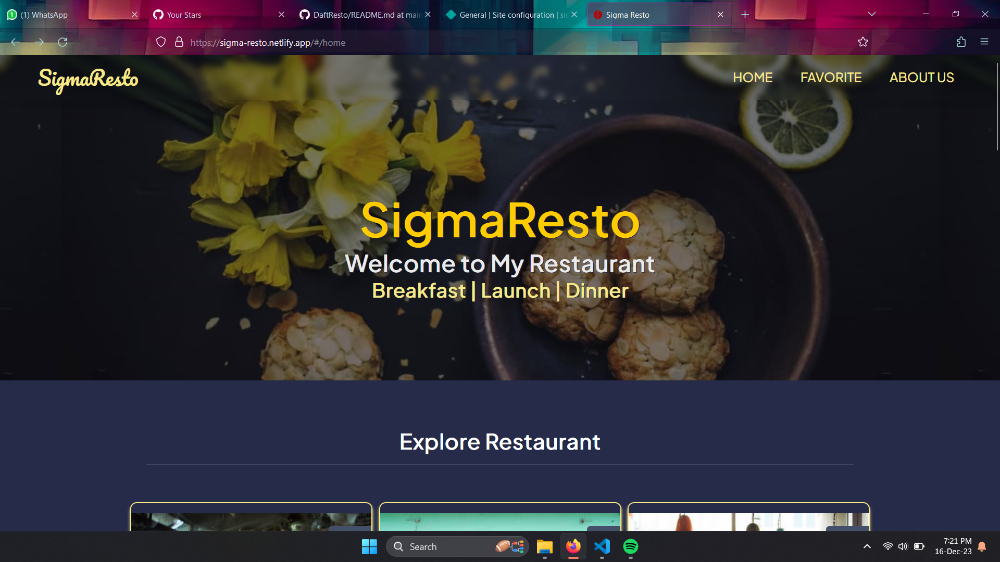

# SigmaResto

**SigmaResto** *(Restaurant Catalog)* - Aplikasi katalog restoran untuk submission kelas [Menjadi Front-End Developer Expert](https://www.dicoding.com/academies/219). Rating submission Bintang 5⭐

## Sekilas

## Aplikasi Katalog Restoran menerapkan :

1. PWA - *Progressive Web Apps*.
2. Responsivitas, Aksesibilitas dan Optimasi bundle dan gambar.
3. Minifikasi CSS dengan menggunakan `MiniCssExtractPlugin` dan `CssMinimizerPlugin`.
4. *Transpiling* dengan menggunakan `babel-loader`.
5. IndexedDB Favorite Restaurant.
6. *Testing* dengan Integration Test dan End to End Test.

## Fitur Aplikasi Katalog Restoran :
* Katalog Restoran
* Detail Rsetoran
* Favorite Restoran
* Search Favorite Restoran
* Offline mode
* Add to HomeScreen

## Scripts

1. Build dengan menginstall semua package yang dibutuhkan dan Starting production server

   `npm run build-serve`

2. Integration test

   `npm run test`

3. End to End (E2E) test

   `npm run e2e`

Demo Aplikasi : <a href="https://sigma-resto.netlify.app/">SigmaResto</a>

