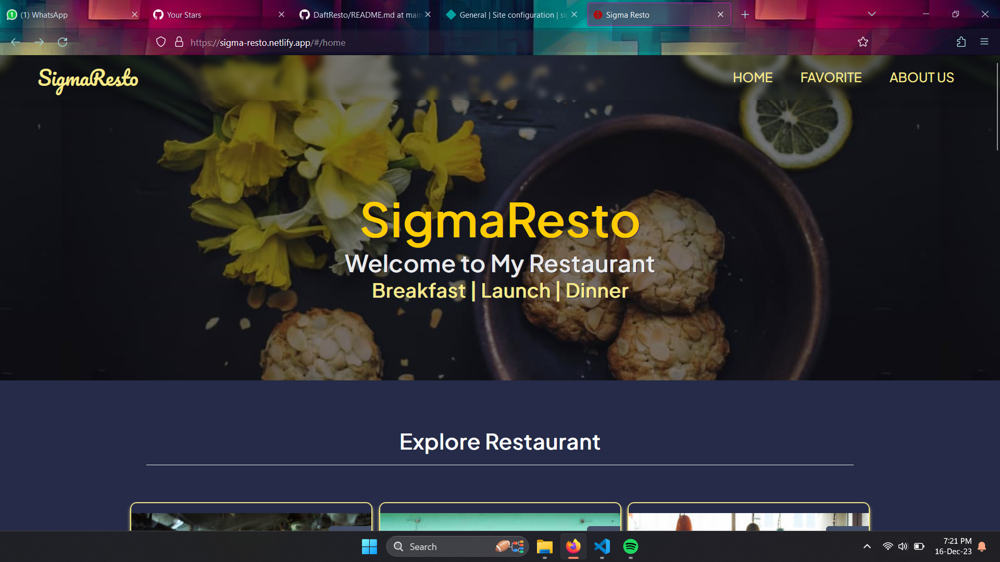

# SigmaResto

**SigmaResto** *(Restaurant Catalog)* merupakan Progressive Web App katalog restoran, dibuat sebagai submission kelas [Menjadi Front-End Web Developer Expert](https://www.dicoding.com/academies/219) — Dicoding. Submission ini merupakan proyek akhir dari jalur Front-End Web, mendapat rating **5/5**.

**Demo:** [Sigma Resto](https://sigma-resto.netlify.app/)

## Preview



## Ringkasan

SigmaResto merupakan proyek paling kompleks dalam jalur pembelajaran ini mencakup implementasi PWA penuh (installable, offline-capable, push notification), optimasi performa (image & bundle), serta strategi testing bertingkat (unit, integration, dan end-to-end).

## Fitur

- Katalog & pencarian restoran
- Detail restoran (menu, lokasi, ulasan)
- Simpan restoran favorit menggunakan IndexedDB
- Pencarian di dalam daftar favorit
- Mode offline (data & aset ter-cache)
- Add to Home Screen (installable seperti aplikasi native)
- Push notification

## Aspek Teknis

| Area | Implementasi |
|---|---|
| **PWA** | Service worker via Workbox (`GenerateSW`), caching API dengan strategi `StaleWhileRevalidate` |
| **Penyimpanan Offline** | IndexedDB melalui library `idb`, untuk fitur restoran favorit |
| **Optimasi Gambar** | Kompresi JPEG dengan `imagemin-mozjpeg`, plus skrip kustom (`sharp.js`) untuk generate varian gambar `large`/`small` per breakpoint, didukung `lazysizes` untuk lazy-loading |
| **Optimasi Bundle** | Code splitting (`splitChunks`), minifikasi CSS (`CssMinimizerPlugin`), transpiling ES6+ ke browser lama (`babel-loader`), analisis ukuran bundle (`webpack-bundle-analyzer`) |
| **Aksesibilitas & Responsivitas** | Struktur semantic HTML, navigasi keyboard-friendly, layout adaptif di berbagai ukuran layar |

## Strategi Testing

Proyek ini menerapkan tiga lapis pengujian:

1. **Unit & Integration Test** — menggunakan Karma + Jasmine, mencakup skenario seperti menambah/menghapus restoran favorit (`likeRestaurantSpec.js`, `unlikeRestaurantSpec.js`), pencarian favorit (`favoriteRestaurantSearchSpec.js`), penyimpanan ke IndexedDB (`favoriteRestaurantIdbSpec.js`), hingga kontrak API (`specs/contract`).
2. **End-to-End (E2E) Test** — menggunakan CodeceptJS dengan Puppeteer, mensimulasikan interaksi pengguna nyata di browser.
3. **Continuous testing pipeline** — dapat dijalankan terpisah (`npm run test` untuk unit/integration, `npm run e2e` untuk E2E).

## Tech Stack

- **Build Tool:** Webpack 5 (konfigurasi terpisah untuk `common`, `dev`, `prod`)
- **PWA:** Workbox, Service Worker API, Web App Manifest
- **Storage:** IndexedDB (via `idb`)
- **Testing:** Karma, Jasmine, CodeceptJS, Puppeteer
- **Image Processing:** Sharp, Imagemin
- **Linting:** ESLint (Airbnb Base)

## Struktur Proyek

```
sigmaresto/
├── dist/                       # Hasil build production
├── e2e/                        # Test suite End-to-End (CodeceptJS)
├── specs/                      # Test suite Unit/Integration (Karma + Jasmine)
│   ├── contract/
│   ├── helpers/
│   ├── favoriteRestaurantArraySpec.js
│   ├── favoriteRestaurantIdbSpec.js
│   ├── favoriteRestaurantSearchSpec.js
│   ├── favoriteRestaurantShowSpec.js
│   ├── likeRestaurantSpec.js
│   └── unlikeRestaurantSpec.js
├── src/
│   ├── public/                 # Aset statis & gambar
│   ├── scripts/                # Kode aplikasi (termasuk service worker)
│   ├── styles/
│   ├── templates/
│   └── DATA.json
├── sharp.js                    # Skrip optimasi/resize gambar
├── codecept.conf.js
├── karma.conf.js
├── webpack.common.js
├── webpack.dev.js
├── webpack.prod.js
└── package.json
```

## Instalasi & Menjalankan Proyek

1. Install dependencies

   ```bash
   npm install
   ```

2. Build & jalankan production server

   ```bash
   npm run build-serve
   ```

3. Mode development

   ```bash
   npm run start-dev
   ```

4. Generate ulang varian gambar (opsional)

   ```bash
   npm run build-image
   ```

## Menjalankan Test

```bash
# Unit & Integration Test
npm run test

# End-to-End Test
npm run e2e
```

## Catatan

Fitur offline & IndexedDB paling terasa dampaknya setelah aplikasi diakses minimal sekali secara online (untuk proses caching awal oleh service worker).
